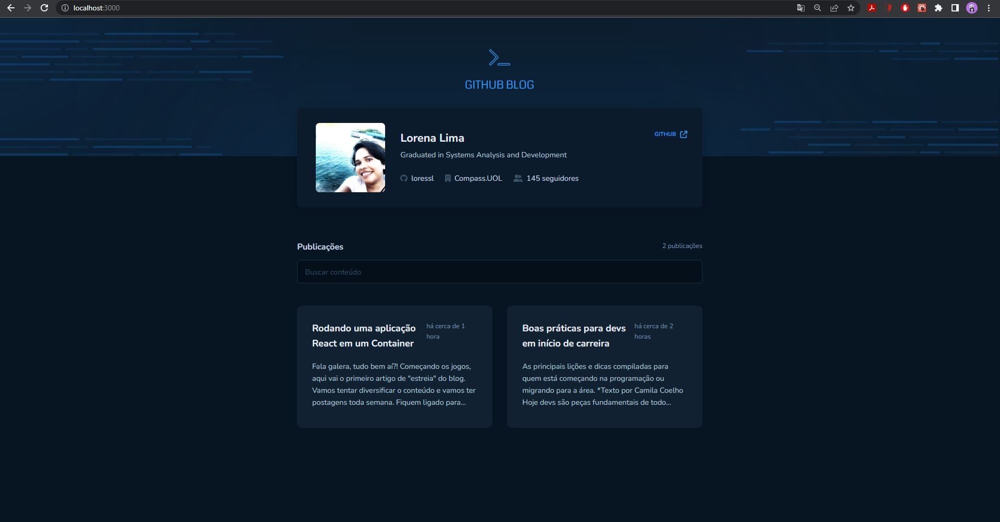
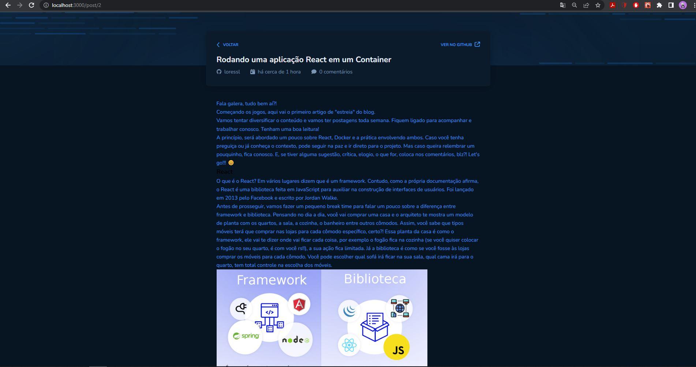

## :bookmark_tabs: Desafio
Este desafio é referente a trilha atualizada do ReactJS do IGNITE e tem como objetivo desenvolver uma aplicação utizando a API do GitHub para buscar:

  - Issues de um repositório
  - Dados do seu perfil
  - Exibir as informações como um blog

Nessa aplicação foram aplicados os conceitos de:
  - Fetch/Axios
  - Roteamento e React Router DOM
  - Formulários

## :sparkler: Aplicação

